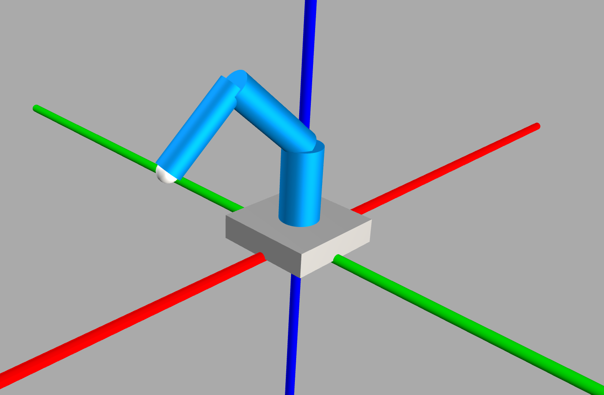
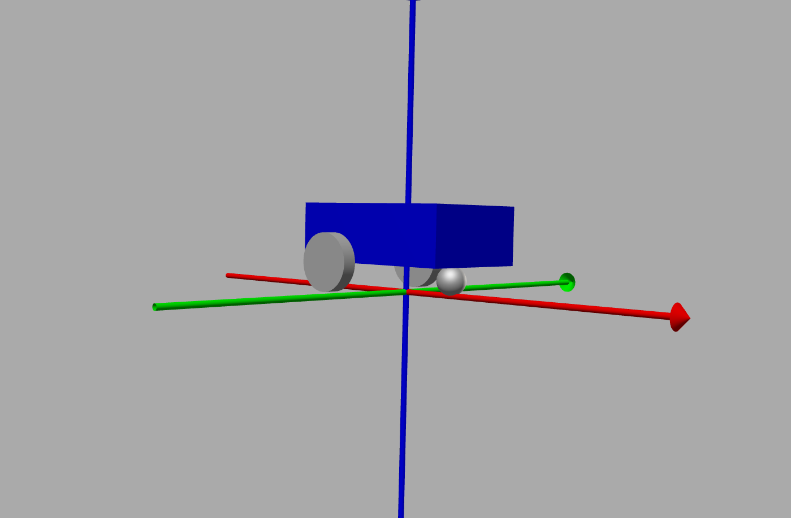
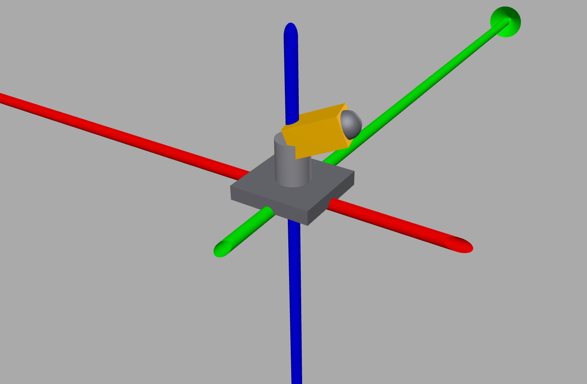

urdfgenpy
=========

**Programmatically generate URDF and Xacro robot description files in pure Python.**

.. raw:: html

   
<strong>Documentation:</strong> <a href="https://urdfgenpy.readthedocs.io">https://urdfgenpy.readthedocs.io</a>

``urdfgenpy`` lets you build valid robot description files from Python objects
- links, joints, geometry, inertia - and export them to ``.urdf`` or
``.xacro`` without writing a single line of XML by hand.

**Key features:**

- No XML - describe your robot entirely in Python
- Automatic inertia tensors from geometry primitives (Box, Cylinder, Sphere)
- URDF and Xacro export with a single ``robot.save()`` call
- Kinematic tree visualisation with colour-coded joint types

Install with `pip <https://pip.pypa.io>`_:

.. code-block:: bash

  pip install urdfgenpy

.. code-block:: python

   from urdfgenpy import (
      Box,
      Collision,
      Cylinder,
      Inertial,
      Joint,
      JointLimit,
      Link,
      Material,
      Origin,
      Robot,
      Visual,
   )

   grey = Material("grey", rgba=(0.5, 0.5, 0.5, 1.0))
   blue = Material("blue", rgba=(0.0, 0.3, 0.8, 1.0))

   # Base link
   base_box = Box(length=0.2, width=0.2, height=0.05)
   base_link = Link("base_link")
   base_link.add_visual(Visual(geometry=base_box, origin=Origin.above(base_box), material=grey))
   base_link.add_collision(Collision(geometry=base_box, origin=Origin.above(base_box)))
   base_link.set_inertial(Inertial.from_geometry(mass=1.0, geometry=base_box))

   # Shoulder link
   shoulder_cyl = Cylinder(radius=0.04, length=0.15)
   shoulder_link = Link("shoulder_link")
   shoulder_link.add_visual(Visual(geometry=shoulder_cyl, origin=Origin.above(shoulder_cyl), material=blue))
   shoulder_link.add_collision(Collision(geometry=shoulder_cyl, origin=Origin.above(shoulder_cyl)))
   shoulder_link.set_inertial(Inertial.from_geometry(mass=0.5, geometry=shoulder_cyl))

   # Joint
   joint = Joint(
      name="base_shoulder_joint",
      joint_type="revolute",
      parent="base_link",
      child="shoulder_link",
      origin=Origin(xyz=(0.0, 0.0, 0.05)),
      axis=(0.0, 0.0, 1.0),
      limit=JointLimit(lower=-3.14, upper=3.14, effort=50.0, velocity=2.0),
   )

   robot = Robot("my_robot")
   for mat in [grey, blue]:
      robot.add_material(mat)
   for link in [base_link, shoulder_link]:
      robot.add_link(link)
   robot.add_joint(joint)

   robot.save("my_robot.urdf")
   robot.print_tree()

----

.. .. grid:: 2
..    :gutter: 3

..    .. grid-item-card:: Getting Started
..       :link: getting_started
..       :link-type: doc

..       Installation and a complete first example - build a two-link arm and
..       export it to URDF in under 30 lines.

..    .. grid-item-card:: Examples
..       :link: examples
..       :link-type: doc

..       Three annotated robots: a 4-DOF serial arm, a differential-drive mobile
..       base, and a 2-DOF pan-tilt unit - each with a 3D turntable animation.

..    .. grid-item-card:: API Reference
..       :link: api/index
..       :link-type: doc

..       Full reference for every public class and function, generated from
..       source docstrings.

..    .. grid-item-card:: Development Guide
..       :link: development
..       :link-type: doc

..       Set up a local environment, run tests, lint, type-check, and open a PR.

..    .. grid-item-card:: Roadmap
..       :link: roadmap
..       :link-type: doc

..       Planned features including DH-parameter import, URDF round-trip parsing,
..       SDF export, and more.

----

License
-------

urdfgenpy is made available under the MIT License. For more details, see `LICENSE <https://github.com/svaibhav101/urdfgenpy/blob/main/LICENSE>`_.

.. toctree::
   :maxdepth: 1
   :caption: User Guide
   :hidden:

   getting_started
   examples
   development
   contributing_docs

.. toctree::
   :maxdepth: 1
   :caption: Reference
   :hidden:

   api/index
   roadmap
